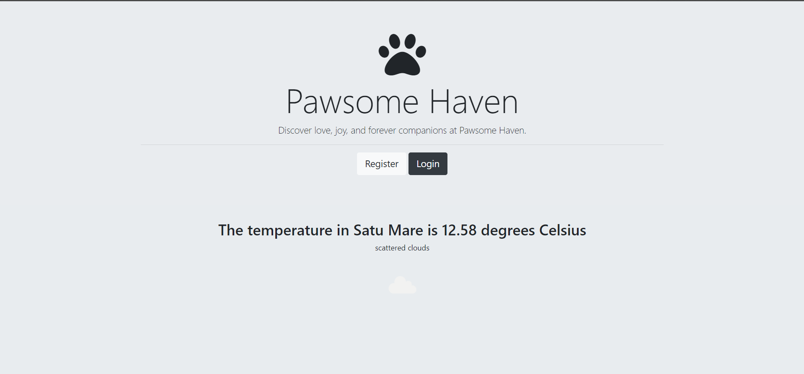
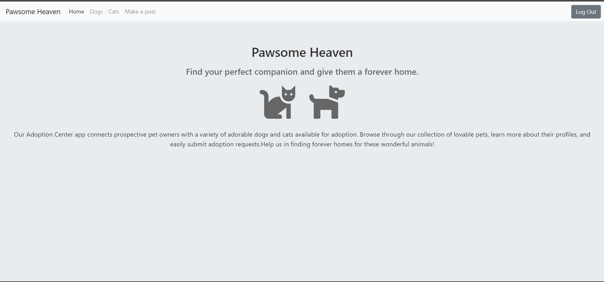
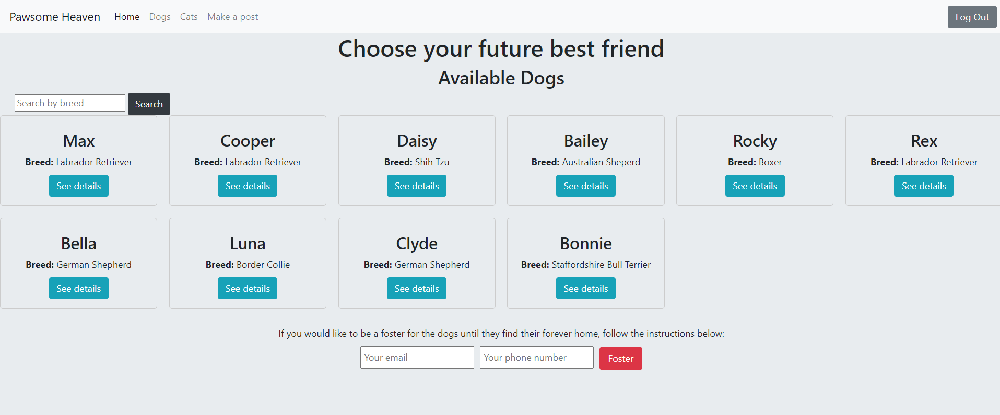
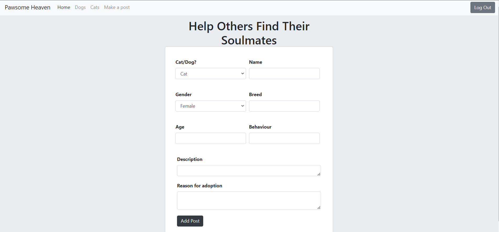

## Adoption Center Webb App
This is a web application for adopting dogs and cats. Users can register, login, view available animals, make adoption posts, and interact with the system. The application integrates with OpenWeatherMap API to display weather information.
## Home Page



## User Dashboard



## Available Dogs Page (and Cats Page)



## Create Adoption Post Page




## Dependecies

- Node.js
- Express.js
- MongoDB
- Mongoose
- EJS (Embedded JavaScript) templating engine
- Body-parser middleware
- mongoose-encryption package
- HTTPS module
- OpenWeatherMap API
## Installation

1. Clone the repository: `git clone https://github.com/MarkusBlanka/Data-Transmision-project.git`
2. Install dependencies: `npm install`
3. Set up MongoDB: Ensure MongoDB is installed and running locally.
4. Update the MongoDB connection URL in `app.js` to match your configuration.
5. Obtain an API key from OpenWeatherMap and update the `apiKey` variable in `app.js` with your key.
6. Start the application: `node app.js`
7. Access the application in your browser at `http://localhost:3000` 
```
## Usage

- Register an account to create a user profile.
- Login with your credentials to access the main features.
- View available dogs and cats for adoption on separate pages.
- Make adoption posts by providing information about the animal.
- View detailed information about a specific dog or cat.
- Delete adoption posts when the animal has been adopted.

## Acknowledgements

This project was developed as the final project for my Data Transmission course.
